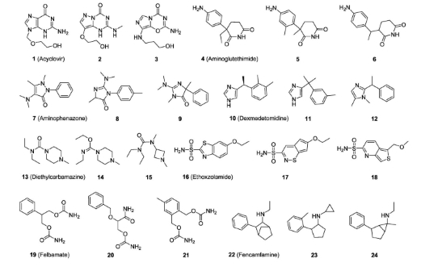
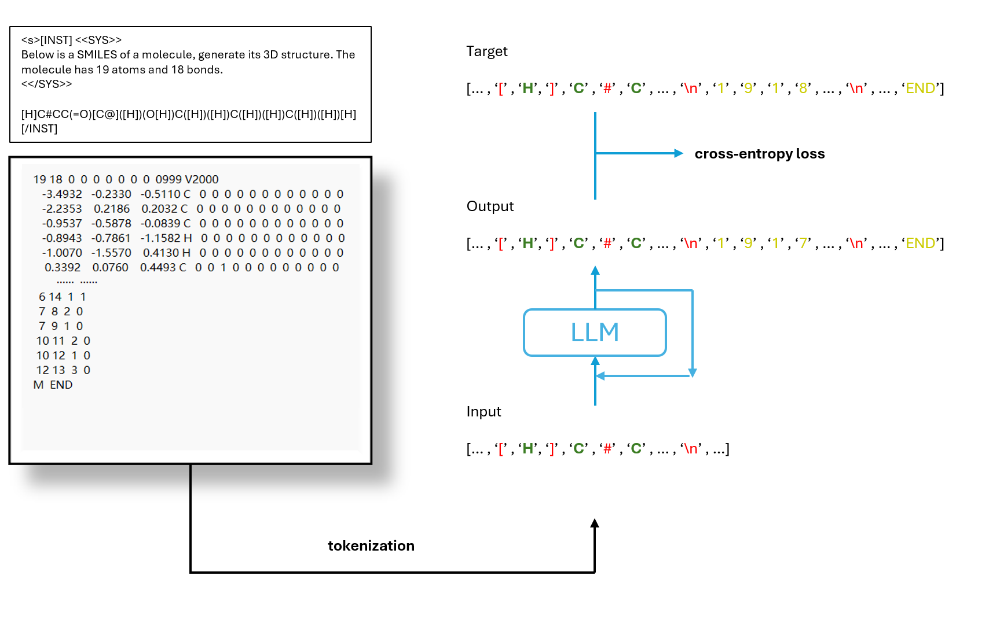
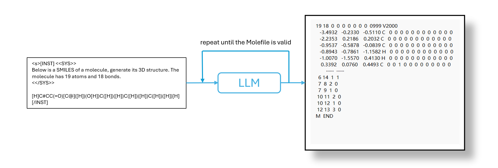

----------------------------


[[PDF]](https://github.com/Lee612-1/smiles2mol) | [[Slides]](https://github.com/Lee612-1/smiles2mol)
 


<p align="center">
   
</p>


## Installation


```bash
# Create conda environment
conda create -n smiles2mol python=3.10

# Activate the environment
conda activate smiles2mol

# Install packages
pip install ...
```


## Dataset 
### Offical Dataset
The offical raw GEOM dataset is avaiable [[here]](https://dataverse.harvard.edu/dataset.xhtml?persistentId=doi:10.7910/DVN/JNGTDF).

### Preprocessed dataset
We provide the preprocessed datasets (qm9) in a [[google drive folder]](https://drive.google.com/drive/folders/13K-h9B8lL10O718M4OLJJpj4iAPtO25r?usp=sharing).
### Prepare your own GEOM dataset from scratch (optional)
Download the raw GEOM dataset and unpack it.

```bash
tar xvf ~/rdkit_folder.tar.gz -C ~/GEOM
```

Preprocess the raw GEOM dataset.

```bash
python script/process_GEOM_dataset.py --base_path GEOM --dataset_name qm9 --confmin 50 --confmax 500
```

The final folder structure will look like this: 

```
GEOM
|___rdkit_folder  # raw dataset
|   |___qm9 # raw qm9 dataset
|   |___drugs # raw drugs dataset
|   |___summary_drugs.json
|   |___summary_qm9.json
|   
|___qm9_processed
|   |___train_data_40k.csv
|   |___val_data_5k.csv
|   |___test_data_200.pkl
|
...
```

## Training

<p align="center">
   
</p>

All hyper-parameters and training details are provided in config files (`./config/*.yml`), and free feel to tune these parameters.

You can train the model with the following commands:

```bash
python -u script/train.py --config_path ./config/qm9_default.yml
```

The checkpoint of the models will be saved into a directory specified in model files.

## Generation

<p align="center">
  
</p>

We provide the checkpoints of four models, i.e., `qm9_default` in a [[google drive folder]](https://drive.google.com/drive/folders/1JX3Xcdl_n-0CEsGwoG9C5kKbgHm_qsxA?usp=sharing).

You can generate conformations of a molecule by feeding its SMILES into the model:

```bash
python -u script/gen.py --config_path ./config/qm9_default.yml --smiles c1ccccc1
```

You can also generate conformations for an entire test set by three modes.
```bash
python -u script/inference.py --config_path ./config/qm9_default.yml # normal
python -u script/inference_d.py --config_path ./config/qm9_default.yml # provide some guidance when inference
python -u script/inference_threading.py --config_path ./config/qm9_default.yml # multi-gpu (max 4)
```

Conformations of some drug-like molecules generated by ConfGF are provided below.

<p align="center">
   
</p>

## Get Results
The results of all benchmark tasks can be calculated based on generated conformations.

We report the results of each task in the following tables. **Results of `ConfGF` and `ConfGFDist` are re-evaluated based on the current code base, which successfully reproduce the results reported in the original paper. Results of other models are taken directly from the original paper.**

### Task 1. Conformation Generation

The COV and MAT scores on the GEOM datasets can be calculated using the following commands:

```bash
python -u script/get_result.py --input GEOM/generated/inference_*_*.pkl --threshold 0.5  
```


Table: COV and MAT scores on GEOM-QM9 small-scale


|    QM9-small     | COV-Mean (%) | COV-Median (%) | MAT-Mean (\AA) | MAT-Median (\AA) |
| :--------: | :----------: | :------------: | :----------------------------------: | :------------------------------------: |
| llama2-7b  |     |       |                           |                              |
| llama2-13b |         |           |                               |                                  |
|    mistral-7b   |         |          |                                |                                  |
|  llama3-8b   |         |           |                                |                                  |


## Visualizing molecules with PyMol

### Start Setup

1. `pymol -R`
2. `Display - Background - White`
3. `Display - Color Space - CMYK`
4. `Display - Quality - Maximal Quality`
5. `Display Grid`
   1. by object:  use `set grid_slot, int, mol_name` to put the molecule into the corresponding slot
   2. by state: align all conformations in a single slot
   3. by object-state: align all conformations and put them in separate slots. (`grid_slot` dont work!)
6. `Setting - Line and Sticks - Ball and Stick on - Ball and Stick ratio: 1.5`
7. `Setting - Line and Sticks - Stick radius: 0.2 - Stick Hydrogen Scale: 1.0`

### Show Molecule

1. To show molecules

   1. `hide everything`
   2. `show sticks`

2. To align molecules: `align name1, name2`

3. Convert RDKit mol to Pymol

   ```python
   from rdkit.Chem import PyMol
   v= PyMol.MolViewer()
   rdmol = Chem.MolFromSmiles('C')
   v.ShowMol(rdmol, name='mol')
   v.SaveFile('mol.pkl')
   ```

### Make the trajectory for Langevin dynamics
1. load a sequence of pymol objects named `traj*.pkl` into the PyMol, where `traji.pkl` is the `i-th` conformation in the trajectory.
2. Join states: `join_states mol, traj*, 0`
3. Delete useless object: `delete traj*`
4. `Movie - Program - State Loop - Full Speed`
5. Export the movie to a sequence of PNG files: `File - Export Movie As - PNG Images`
6. Use photoshop to convert the PNG sequence to a GIF with the transparent background.


## Citation
Please consider citing the following paper if you find our codes helpful. Thank you!
```

```

## Contact
Yanting Li (yli106@connect.hkust-gz.edu.cn)